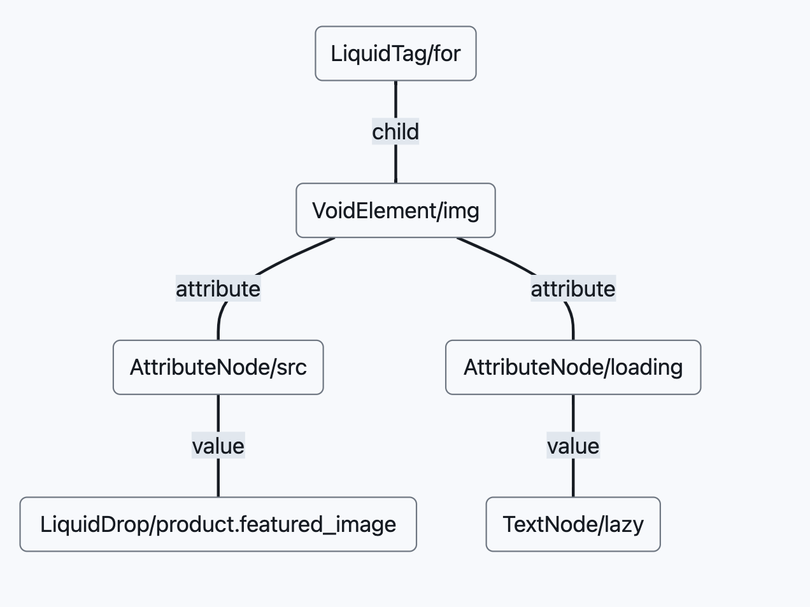

# prettier-plugin-liquid-prototype

Wanted to know how hard it is [to do like the Handlebars folks](https://prettier.io/blog/2021/05/09/2.3.0.html#:~:text=The%20feature%20is,under%20the%20hood.) and make a prettier plugin for Liquid.

Our problem: Liquid is a _templating_ language. As such, its Abstract Syntax Tree (AST) has no notion of what its text nodes contain.

And since [prettier](https://prettier.io/) is really a `function(ast) -> string`, you can't make pretty Liquid + HTML if the AST you have has no notion of HTML.

It's possible though:

https://user-images.githubusercontent.com/4990691/145229362-568ab7d4-4345-42b7-8794-59f7683a88a3.mp4

(That's what this prototype does)

## How we can handle it

First, we need to make a Liquid + HTML parser that supports a stricter form of Liquid.

That is, your Liquid + HTML should form a tree. This works:

```liquid

  

```

Since it can be represented as this tree:



But this can't be represented as a tree:

```liquid
<div></div>
```

Because the `div` closes outside of the liquid if.

Then, we can take that AST and print it into something _prettier_.

## How it works

1. We make an [harc/ohm](https://github.com/harc/ohm) grammar that parses the tokens of the source code. [(Link to LiquidHTML grammar.)](grammar/liquid-html.ohm)
2. We build a Concrete Syntax Tree (CST) with what Ohm gives us. [(Link to Grammar->CST code.)](src/parsers/liquid-html-cst.ts)
3. We build an AST from the CST. [(Link to CST->AST code.)](src/parsers/liquid-html-ast.ts)
4. We pass that AST to the prettier printer and output something pretty. [(Link to LiquidHTML printer)](src/printers/liquid-html-printer.ts)

**Notes:**

- A couple of key decisions were made to optimize development time and are _probably_ not good enough for production.
- I chose Ohm strictly because the syntax is pretty, easy to understand and allows me to skip all the nasty regular expression shenanigans.
- I chose prettier because it's the standard for pretty much every language out there. Also, [partners have been asking for it.](https://github.com/Shopify/theme-check-vscode/issues/32)
- I chose not to implement this directly in [theme-check](https://github.com/Shopify/theme-check) because there's a lot we gain from leveraging the [prettier printer API](https://prettier.io/docs/en/plugins.html#printers) and its [builder methods](https://github.com/prettier/prettier/blob/main/commands.md).

  This means that it's a separate install step. But I'm going with the assumption that folks who use prettier already have it installed.

  The alternative would be to build a prettier equivalent in ruby and isn't reasonable for a prototype.

## Potential problems with the approach

- [Ohm is slow](https://news.ycombinator.com/item?id=15492546). I don't have benchmarks, but there's a lot we could do if we didn't choose development speed.

  Will users care? Is it noticeable? Don't know yet. Might just need to ship it to real users and wait for people to report it being slow.

- It's a _subset_ of Liquid. Need to inform folks that you need to write your liquid this way or else we can't make your code pretty.

## Missing pieces

There's some stuff I didn't do (yet?) that would need to be done for this to be "production" ready.

- Liquid + JavaScript // or a way to ignore the nodes and not mess with the formatting.
- Liquid + CSS // or a way to ignore the nodes and not mess with the formatting.

## Things that would be nice

- Formatting of the _insides_ of Liquid nodes (e.g. spaces around operators, breaking of pipelines, etc.)
- Liquid + JavaScript (very hard)
- Liquid + CSS (hard)
